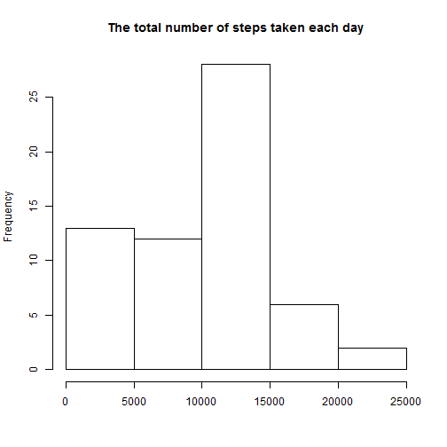

## Loading the data and packages

```r
library(dplyr)
library(lubridate)
library(ggplot2)

datatemp <- read.csv("temp/activity.csv")
data <- tbl_df(datatemp)
rm(datatemp)
```

## What is mean total number of steps taken per day?
1.Process the data

```r
day_sum <-
    data %>%
    group_by(date)%>%
    summarize(sum=sum(steps,na.rm=TRUE))
```
2.Make a histogram of the total number of steps taken each day

```r
hist(day_sum$sum,main='The total number of steps taken each day',xlab = "")
```



3.Calculate and report the mean and median total number of steps taken per day

```r
mean_sum <- mean(day_sum$sum)
median_sum <- median(day_sum$sum)
```
The mean of steps taken per day is  9354.2295082.  
The median of steps taken per day is 10395.

## What is the average daily activity pattern?
1.Process the data

```r
interval_avg <-
    data %>%
    group_by(interval)%>%
    summarize(mean=mean(steps,na.rm=TRUE))
```
2.Make a time series plot (i.e. type = "l") of the 5-minute interval (x-axis) and the average number of steps taken, averaged across all days (y-axis)

```r
 plot(interval_avg$interval,interval_avg$mean,type = "l",xlab = "Interval",ylab = "Average daily",main="The average daily activity pattern")
```


3.Which 5-minute interval, on average across all the days in the dataset, contains the maximum number of steps?

```r
whicMaxInterval<- interval_avg[which.max(interval_avg$mean),]$interval
```
835 contains the maximum number of steps.

## Imputing missing values
1.Calculate and report the total number of missing values in the dataset (i.e. the total number of rows with NAs)

```r
naNum <- sum(is.na(data$steps))
```
The total number of missing values in the dataset is 2304.  
2.Create a new dataset that is equal to the original dataset but with the missing data filled in.And I use the mean for that 5-minute interval.

```r
datafilled <- data
fillindx <- datafilled[is.na(datafilled$steps), ]$interval
fillvalue <- sapply(fillindx,function(elem) interval_avg[interval_avg$interval==elem,]$mean)
datafilled[is.na(datafilled$steps),1] <- fillvalue
```
3.Make a histogram of the total number of steps taken each day and Calculate and report the mean and median total number of steps taken per day

```r
day_sum_filldata <-
     datafilled %>%
     group_by(date)%>%
     summarize(sum=sum(steps))
hist(day_sum_filldata$sum,main='The total number of steps taken each day',xlab = "")
```


4.Calculate and report the mean and median total number of steps taken per day

```r
 mean_sum_filldata <- mean(day_sum_filldata$sum)
 median_sum_filldata <- median(day_sum_filldata$sum)
```
The mean of steps taken per day is  1.0766189 &times; 10<sup>4</sup>.  
The median of steps taken per day is 1.0766189 &times; 10<sup>4</sup>.  
Replacing NAs with the average steps for the interval raised both the number of mean and median steps.

## Are there differences in activity patterns between weekdays and weekends?
1.Create a new factor variable in the dataset with two levels -- "weekday" and "weekend" indicating whether a given date is a weekday or weekend day

```r
datafilled$weekdays <- "weekday"
datafilled[which(wday(ymd(datafilled$date)) %in% c(6,7) ),]$weekdays <- "weekend"
```
2.Make a panel plot containing a time series plot (i.e. type = "l") of the 5-minute interval (x-axis) and the average number of steps taken, averaged across all weekday days or weekend days (y-axis)

```r
interval_avg_weekdays <-
     datafilled %>%
     group_by(weekdays,interval)%>%
     summarize(mean=mean(steps))
qplot(interval,mean,data=interval_avg_weekdays,facets=weekdays ~ . ,geom="line")
```


